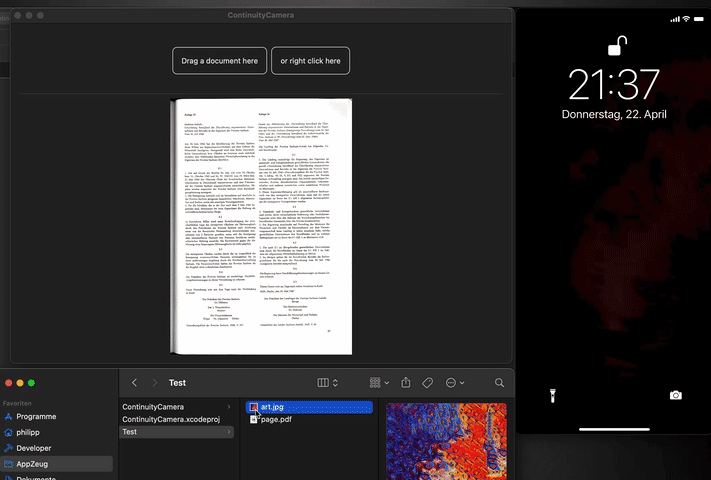

#  Continuity Camera

This is another learning project where I investigate how I can incorporate the "Continuity Camera" API, available in macOS to easily take pictures and scan documents, into SwiftUI.

It was inspired by Apples developer article: [Supporting Continuity Camera in Your Mac App](https://developer.apple.com/documentation/appkit/supporting_continuity_camera_in_your_mac_app) which shows how to incorporate it into an AppKit app.

## Demo

This demo app shows an alternative way to import an image into your app. It shows the apps main window into which files can be dragged, or the "Continuity Camera" can be triggered by using the context action on the second button.

